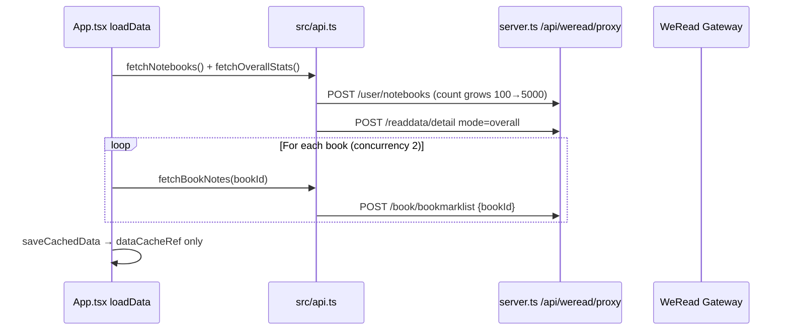
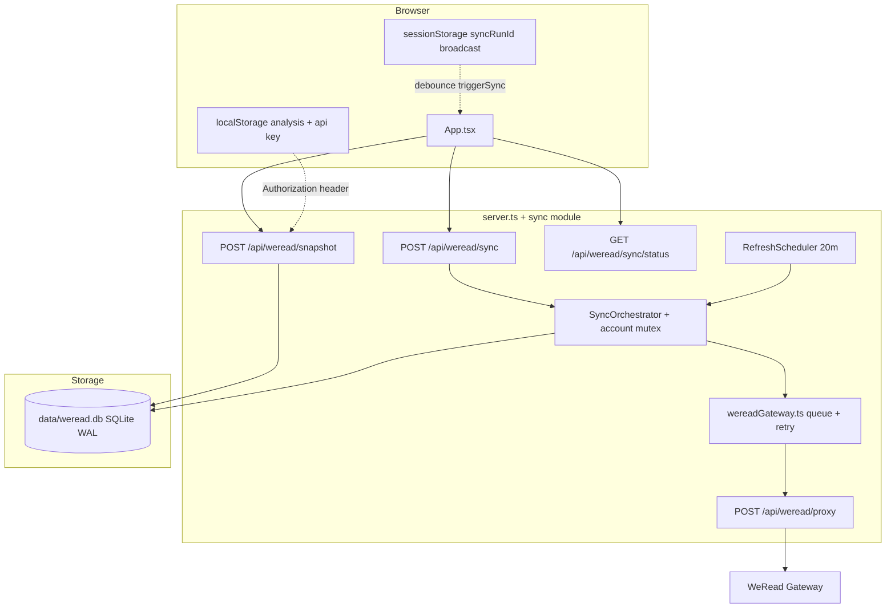
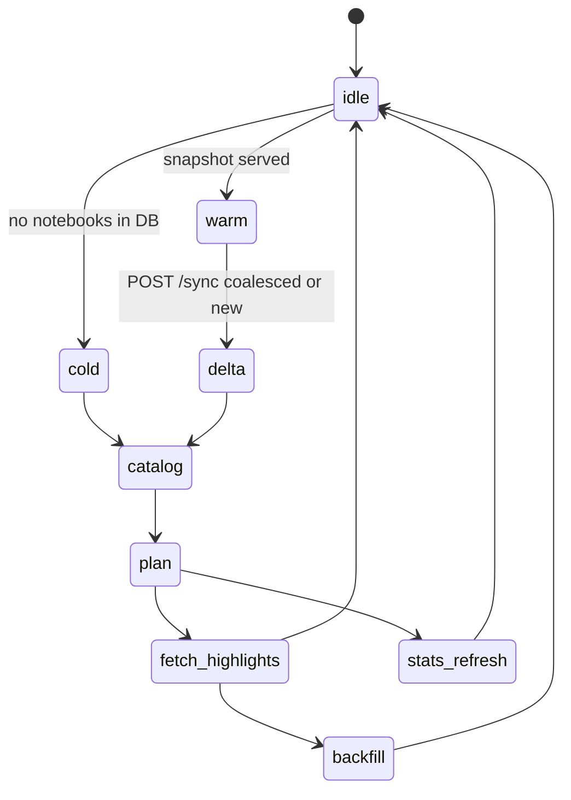
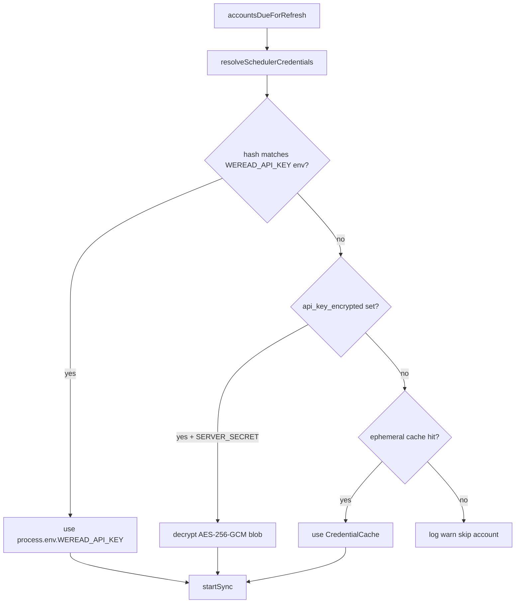

# WeRead Visualization — Server-Side Persistence & Delta Sync

| Field | Value |
|-------|-------|
| **Author** | TBD |
| **Date** | 2026-06-02 |
| **Status** | Draft (rev. 3 — re-review) |
| **Repo** | `/Users/tonysun/workspace/weread-visualization` |

---

## Overview

The weread-visualization app currently performs a **full cold sync** on every page load in WeRead mode: `loadData()` in `src/App.tsx` always calls `fetchNotebooks()` and `mapWithConcurrency(books, 2, fetchBookNotes)` unless the in-memory `dataCacheRef` is warm within the same browser session. A full page refresh discards that cache and re-fetches **one `/book/bookmarklist` per book** plus repeated `/user/notebooks` growth requests and `/readdata/detail` — often **200+ gateway calls** for a medium library, bounded by client-side rate limiting (`WEREAD_MAX_CONCURRENT = 2`, `WEREAD_MIN_REQUEST_GAP_MS = 400`, `WEREAD_PROXY_RETRIES = 6` in `src/api.ts`).

This design introduces a **server-side SQLite cache** (`better-sqlite3`, `data/weread.db`), a **sync orchestrator** on Express, and a **fast-path API** so the UI paints from the database immediately while delta sync and backfill run in the background. Periodic refresh runs every **20 minutes** per account. The existing `/api/weread/proxy` route remains the single gateway transport; sync logic moves server-side so work survives tab close and shares one DB file.

**v1 highlight sync default:** Fingerprint-driven **full bookmarklist** per changed book (`{ bookId }` only — same as `fetchBookNotes` today). Incremental `synckey`/`removed` is **opt-in behind an env flag** after a documented gateway spike (see [Highlight sync modes](#2-highlights--bookbookmarklist)).

---

## Background & Motivation

### Current flow (verified)



**Pain points**

| Issue | Impact | Evidence |
|-------|--------|----------|
| No durable cache | Every refresh = full cold sync | `saveCachedData` only writes `dataCacheRef` (`App.tsx:297-299`) |
| O(books) bookmarklist calls | 2–5 min first load; rate-limit risk | `mapWithConcurrency(books, 2, fetchBookNotes)` (`App.tsx:515-550`) |
| Suboptimal notebook pagination | Extra `/user/notebooks` calls | `fetchNotebooks` doubles `count` instead of `lastSort` (`api.ts:416-456`) |
| Client-owned sync | Tab close aborts work; no cross-device cache | All sync in browser |
| Stats refetched every load | Unnecessary `/readdata/detail` | Always paired with notebooks in `loadData` (`App.tsx:500-503`) |
| Reviews not fetched | `reviewCount` in catalog ignored for content | App only uses `bookmarklist` (`notes.md`) |

Analysis (AI personality) correctly stays in **localStorage** (`readStoredAnalysis` / `writeStoredAnalysis` at `App.tsx:301-338`); this design does not move analysis to SQLite.

**Doc nits (verified):** Line ranges above match current tree. Repo `.gitignore` does **not** yet include `data/` — PR1 must add `data/` and `data/weread.db`.

### Gateway capabilities (relevant subset)

From `~/.agents/skills/weread-skills/` and `/_list` (16 APIs).

| API | Role in viz app | v1 delta mechanism |
|-----|-----------------|-------------------|
| `/user/notebooks` | Catalog of books with notes | `lastSort` cursor pagination; fingerprint `(sort, noteCount, reviewCount, bookmarkCount)` |
| `/book/bookmarklist` | Highlight text (`updated[]`) | **v1:** full fetch `{ bookId }` when fingerprint changes. **Optional:** incremental `synckey` + `removed` if `WEREAD_BOOKMARKLIST_INCREMENTAL=1` and spike passes |
| `/readdata/detail` | Overall stats blob | TTL cache (20m) |
| `/review/list/mine` | User reviews/thoughts | Not in v1; optional phase-2 |

**`/book/bookmarklist` contract (verified vs docs):** `notes.md` documents only `bookId` as a request parameter and does not document response `removed` or incremental request semantics. `WeReadBookNotesResponse` (`src/types.ts:47-52`) includes `synckey`; `fetchBookNotes` (`api.ts:468-471`) always sends `{ bookId }` only. **Do not rely on incremental bookmarklist in v1.**

**Not in scope for v1:** `/shelf/sync`, `/book/bestbookmarks`, `/book/underlines`.

---

## Deployment Constraints

Server-side sync **requires** a long-running Node process and a **writable persistent volume** for `data/weread.db`.

| Deploy path | Server sync | Notes |
|-------------|-------------|-------|
| `npm run dev` / `npm run start` (`node dist/server.cjs`) | **Supported** | Express + SQLite; create `data/` on boot |
| Netlify (`netlify.toml`: `publish = "dist"`, SPA redirect) | **Not supported** | Static assets only — no Node, no disk. Snapshot/sync routes unavailable |
| Serverless / ephemeral FS | **Not supported** | DB would be lost between invocations |

**PR9 / README** must state: use VM, Docker, or local `npm run start` for WeRead persistence; Netlify publish-only remains **static frontend + legacy client cold sync** (or proxy to a remote Node backend if user self-hosts API elsewhere).

See [Alternatives Considered](#alternatives-considered) — cross-ref this section for hosting.

---

## Goals & Non-Goals

### Goals

1. **Fast startup:** `POST /api/weread/snapshot` returns assembled `CachedModeData`-equivalent JSON from SQLite in **&lt;100ms** (local disk) for typical accounts.
2. **Delta sync:** After warm cache, paginate catalog with `lastSort`; **full bookmarklist only for fingerprint-changed/new books** (v1). Incremental bookmarklist optional post-spike.
3. **Background backfill:** Serve stale/partial DB immediately; fill missing per-book highlights without blocking first paint.
4. **20-minute periodic refresh:** `REFRESH_INTERVAL_MS = 20 * 60 * 1000` per account.
5. **Reduced API calls:** `lastSort` pagination; skip unchanged books (fingerprint); stats TTL; single server rate limiter **with retry parity** to `api.ts`.
6. **Multi-user safe:** Scope by `account_key_hash` (SHA-256 of API key); never persist raw Bearer token.
7. **Multi-tab safe:** Server idempotent `POST /sync`; every tab obtains `syncRunId` and polls; `sessionStorage` broadcasts active run id.

### Non-Goals

- Syncing **Obsidian mode** to SQLite (`weread_obsidian_payload` in `localStorage`; `App.tsx:428-490` unchanged).
- Moving **AI analysis** to server DB (`App.tsx:301-338`, `574-575`).
- Bookmark content export, full review text in v1, multi-tenant SaaS hardening.
- Replacing `/api/weread/proxy-cover` or `/api/weread/analyze`.
- Netlify-only static deploy with embedded SQLite (incompatible — see [Deployment Constraints](#deployment-constraints)).

---

## Proposed Design

### Architecture



### Module layout (new files)

```
server/
  db.ts              # init: WAL, mkdir data/, chmod 0600, migrations
  account.ts         # hashApiKey(), upsertAccount()
  sync/
    orchestrator.ts  # state machine, per-account mutex
    catalog.ts       # /user/notebooks + fingerprint diff
    highlights.ts    # FULL_REPLACE | INCREMENTAL_* modes
    stats.ts         # /readdata/detail + TTL
    snapshot.ts      # assemble JSON (see Snapshot assembly)
    scheduler.ts     # 20m refresh + credential resolution
    credentials.ts   # env / encrypted DB / ephemeral cache for scheduler
  wereadGateway.ts   # IPv4 post + slot + gap + retries (port from api.ts)
data/
  weread.db          # gitignored (add data/ in PR1)
```

`server.ts` wires routes; registers sync routes only when `WEREAD_SERVER_SYNC=1`.

### Concurrency, multi-tab, and idempotency

**Problem:** Each browser tab has its own `dataCacheRef` (`App.tsx:278`) but shares one server DB. Uncoordinated `POST /sync` from N tabs duplicates gateway work.

#### Server-side (authoritative)

```typescript
// orchestrator.ts
async function startSync(accountId: number, opts: { force?: boolean }): Promise<SyncStartResponse> {
  const running = db.getRunningSyncRun(accountId);
  if (running) {
    return { syncRunId: running.id, status: "running", mode: running.mode, coalesced: true };
  }
  const syncRunId = db.insertSyncRun(accountId, ...);
  void runSyncJob(accountId, syncRunId, opts); // single in-process worker per account
  return { syncRunId, status: "running", coalesced: false };
}
```

- **Invariant:** At most one `sync_runs.status = 'running'` per `account_id`.
- **Duplicate `POST /sync`:** HTTP `202` with existing `syncRunId`, `coalesced: true` (no second job).
- Scheduler uses same `startSync` entrypoint.

#### Client-side (every tab participates)

**Rule:** After every successful `POST /snapshot`, **always** call `POST /sync` (idempotent). Server mutex prevents duplicate jobs; response always includes a `syncRunId` (new or coalesced). **Never** skip `POST /sync` based on tab “leader” — that caused non-leader tabs to miss active sync progress.

```typescript
const ACTIVE_SYNC_RUN_KEY = "weread_active_sync_run_id"; // shared across tabs (sessionStorage)

function broadcastSyncRunId(syncRunId: number): void {
  sessionStorage.setItem(ACTIVE_SYNC_RUN_KEY, String(syncRunId));
  sessionStorage.setItem("weread_sync_run_started_at", String(Date.now()));
  try {
    const bc = new BroadcastChannel("weread_sync");
    bc.postMessage({ type: "syncRunId", syncRunId });
    bc.close();
  } catch { /* optional */ }
}

function listenForSyncRunId(onRunId: (id: number) => void): () => void {
  const handler = (e: MessageEvent) => {
    if (e.data?.type === "syncRunId") onRunId(e.data.syncRunId);
  };
  try {
    const bc = new BroadcastChannel("weread_sync");
    bc.addEventListener("message", handler);
    return () => bc.close();
  } catch {
    return () => {};
  }
}

async function resolveSyncRunId(meta: SnapshotMeta): Promise<number> {
  // 1) Prefer snapshot meta if sync already running
  if (meta.syncInProgress && meta.syncRunId) return meta.syncRunId;
  // 2) Another tab may have broadcast id
  const stored = Number(sessionStorage.getItem(ACTIVE_SYNC_RUN_KEY) || 0);
  if (stored > 0) return stored;
  // 3) Always ask server (coalesced or new)
  const res = await triggerSync();
  broadcastSyncRunId(res.syncRunId);
  return res.syncRunId;
}
```

**Tab A mid-sync, Tab B loads:** B `POST /snapshot` → stale canvas → `POST /sync` → `{ syncRunId: 42, coalesced: true }` → B polls `GET /sync/status` and shows overlay. If A already broadcast `42` to `sessionStorage` / `BroadcastChannel`, B can poll immediately even before sync response returns.

### Sync state machine



| State | Definition | User-visible behavior |
|-------|------------|----------------------|
| **cold** | No active `notebooks` for account | Overlay `catalog` → `notes`; canvas may be empty |
| **warm** | DB has catalog + highlights | Instant canvas; see [UI state](#ui-state-loading-vs-overlay-vs-stale-badge) |
| **delta** | Fingerprint diff enqueued N books | Overlay `sync`; progress from `sync/status` |
| **backfill** | `book_notes_sync.sync_status != 'ok'` | Overlay `backfill`; canvas usable |

### Delta algorithms

#### 1. Catalog — `/user/notebooks`

Cursor pagination per `notes.md` (replaces `api.ts` count-doubling):

```typescript
async function fetchFullCatalog(gateway): Promise<CatalogBook[]> {
  const all: CatalogBook[] = [];
  let lastSort: number | undefined;
  const pageSize = 100;
  do {
    const body: Record<string, unknown> = { count: pageSize };
    if (lastSort != null) body.lastSort = lastSort;
    const page = await gateway.call("/user/notebooks", body);
    const books = dedupeByBookId(page.books ?? []);
    all.push(...books);
    if (!page.hasMore) break;
    lastSort = books[books.length - 1]?.sort;
  } while (lastSort != null);
  return all;
}
```

**Fingerprint:**

```
fp = sha256(bookId + "|" + sort + "|" + noteCount + "|" + reviewCount + "|" + bookmarkCount)
```

**Diff rules:**

| Condition | Action |
|-----------|--------|
| In API, not in DB | INSERT; enqueue bookmarklist (**FULL_REPLACE**) |
| In both, `fp` changed | UPDATE; enqueue bookmarklist |
| In DB, not in API (`deleted_at` null) | `deleted_at = now()`; `DELETE highlights` for book |
| In both, `fp` same | Skip bookmarklist |

**Known limitation (fingerprint blind spot):** Highlight text can change without catalog count/sort changing (e.g. edit/delete highlight while aggregates unchanged). v1 mitigations:

| Mitigation | When |
|------------|------|
| **M1 — Stale book TTL** | If `note_count > 0` and `last_fetched_at` older than `BOOKMARKLIST_MAX_AGE_MS` (default 7d), enqueue FULL_REPLACE even when `fp` same |
| **M2 — Refresh counter** | When `accounts.catalog_refresh_count % FULL_REFRESH_EVERY_N === 0` after a successful **delta** sync (default N=**4**), enqueue FULL_REPLACE for all books with `note_count > 0`; increment counter on delta completion; reset to `0` on `force` |
| **M3 — Force** | `POST /sync { force: true }` or settings refresh |
| **M4 — Incremental (post-spike)** | If `WEREAD_BOOKMARKLIST_INCREMENTAL=1` and stored `book_notes_sync.synckey !== response.synckey` with unchanged `fp`, enqueue INCREMENTAL_MERGE |

Today’s client path has no blind spot because it always refetches every book; document this trade-off in UI copy for “数据可能不是最新”.

#### 2. Highlights — `/book/bookmarklist`

**Feature flag:** `WEREAD_BOOKMARKLIST_INCREMENTAL=0` (default). When `0`, only **FULL_REPLACE** runs.

**Spike (PR2 or PR4):** Capture real gateway traffic: request with `synckey`, observe `removed`, empty `updated`, errcode on bad synckey. Record results in `docs/weread-bookmarklist-incremental.md`. Enable flag only after spike passes.

##### Apply modes (mutually exclusive per fetch)

| Mode | When | DB steps |
|------|------|----------|
| **FULL_REPLACE** | Default v1; `force`; incremental disabled or spike failed | (1) `DELETE FROM highlights WHERE account_id=? AND book_id=?` (2) `INSERT` each `updated[]` (3) set `book_notes_sync.synckey` from response (4) `highlight_count = COUNT(*)` |
| **INCREMENTAL_MERGE** | `WEREAD_BOOKMARKLIST_INCREMENTAL=1` and valid stored `synckey` | (1) `DELETE` each id in `removed[]` (2) `UPSERT` each `updated[]` (3) update `synckey` (4) recompute `highlight_count` |
| **INCREMENTAL_NOOP** | Incremental on; `updated` and `removed` both empty | Bump `last_fetched_at` only; keep rows |

```typescript
type HighlightApplyMode = "FULL_REPLACE" | "INCREMENTAL_MERGE" | "INCREMENTAL_NOOP";

function resolveMode(account, bookId, fpChanged: boolean): HighlightApplyMode {
  if (!process.env.WEREAD_BOOKMARKLIST_INCREMENTAL) return "FULL_REPLACE";
  const row = db.getBookNotesSync(account.id, bookId);
  if (!row?.synckey || fpChanged) return "FULL_REPLACE";
  return "INCREMENTAL_MERGE"; // may become NOOP after response
}

async function syncBookHighlights(accountId, bookId, mode: HighlightApplyMode): Promise<void> {
  const params: Record<string, unknown> = { bookId };
  if (mode === "INCREMENTAL_MERGE") {
    params.synckey = db.getBookNotesSync(accountId, bookId)!.synckey;
  }
  const res = await gateway.call("/book/bookmarklist", params);

  if (mode === "INCREMENTAL_MERGE" && isIncrementalRejected(res)) {
    return syncBookHighlights(accountId, bookId, "FULL_REPLACE");
  }

  const effectiveMode =
    mode === "INCREMENTAL_MERGE" && !(res.updated?.length) && !(res.removed?.length)
      ? "INCREMENTAL_NOOP"
      : mode === "INCREMENTAL_MERGE" ? "INCREMENTAL_MERGE" : "FULL_REPLACE";

  db.transaction(() => {
    if (effectiveMode === "FULL_REPLACE") {
      db.deleteHighlightsForBook(accountId, bookId);
      for (const h of res.updated ?? []) db.insertHighlight(accountId, bookId, h);
    } else if (effectiveMode === "INCREMENTAL_MERGE") {
      for (const id of res.removed ?? []) db.deleteHighlight(accountId, bookId, id);
      for (const h of res.updated ?? []) db.upsertHighlight(accountId, bookId, h);
    }
    const count = db.countHighlights(accountId, bookId);
    db.upsertBookNotesSync({
      accountId, bookId,
      synckey: Number(res.synckey ?? 0),
      sync_status: "ok",
      last_fetched_at: Date.now(),
      highlight_count: count
    });
    assert(count === db.countHighlights(accountId, bookId)); // invariant
  });
}
```

**Concurrency:** `WEREAD_MAX_CONCURRENT = 2`, `WEREAD_MIN_REQUEST_GAP_MS = 400`.

**Steady-state API calls (v1, fp-only):** 0 catalog changes → **0** bookmarklist; 3 books with changed fp → **3** bookmarklist + ~4 catalog pages.

#### 3. Stats — `/readdata/detail`

`STATS_TTL_MS = REFRESH_INTERVAL_MS = 20 * 60 * 1000`. One gateway call per window; store in `stats_cache.payload_json`.

#### 4. Background backfill

Enqueue when: missing `book_notes_sync`, `sync_status IN ('pending','error')`, or `note_count > 0 AND highlight_count < note_count`. Runs after delta queue; same rate limiter.

#### 5. Periodic refresh

Scheduler tick 60s; `accountsDueForRefresh(REFRESH_INTERVAL_MS)` → `startSync` (coalesced).

**M2 counter (orchestrator):** When `sync_runs` transitions to `status='done'` and `mode='delta'`:

```typescript
db.incrementCatalogRefreshCount(accountId);
if (account.catalog_refresh_count % FULL_REFRESH_EVERY_N === 0) {
  enqueueFullBookmarklistSweep(accountId); // all books with note_count > 0
}
```

`POST /sync { force: true }` sets `accounts.catalog_refresh_count = 0` before enqueue.

#### 6. Scheduler credentials (PR7)

Background refresh runs **without a browser**. Gateway calls still need a Bearer token. Resolution order per due `account_id`:



| Tier | Mechanism | When |
|------|-----------|------|
| **T1 — Single-user dev (default)** | `process.env.WEREAD_API_KEY` | Scheduler runs gateway sync **only** for `accounts.account_key_hash === hashApiKey(WEREAD_API_KEY)`. If env unset → scheduler disabled with one-time log. Matches `server.ts` proxy fallback (`526`). |
| **T2 — Encrypted at rest (browser-sourced)** | `accounts.api_key_encrypted` BLOB | On every `POST /snapshot` / `POST /sync` with `Authorization`, server upserts account and stores `encrypt(apiKey, SERVER_SECRET)` (AES-256-GCM, random IV). Scheduler decrypts for that `account_id`. **Requires** `SERVER_SECRET` (32+ byte env). Never store raw key in plaintext columns. |
| **T3 — Ephemeral cache (multi-account helper)** | `CredentialCache: Map<accountId, { apiKey, gatewayUrl, skillVersion, expiresAt }>` | Populated on each authenticated snapshot/sync request; TTL = `REFRESH_INTERVAL_MS + 5min`. Lost on process restart until next client visit or T2 blob. |

**Not stored:** Raw API key in logs, `account_key_hash` is one-way only.

**Multi-account without T2:** Background refresh for account B does not run until B’s client has visited once (T3) or operator sets `WEREAD_API_KEY` for single-user.

**Netlify static-only:** Scheduler never runs (no Node process) — see [Deployment Constraints](#deployment-constraints).

```typescript
// server/sync/credentials.ts
export function onAuthenticatedRequest(accountId: number, creds: WeReadCredentials): void {
  credentialCache.set(accountId, { ...creds, expiresAt: Date.now() + REFRESH_INTERVAL_MS + 300_000 });
  if (process.env.SERVER_SECRET) {
    db.updateAccountEncryptedKey(accountId, encryptApiKey(creds.apiKey, process.env.SERVER_SECRET));
  }
}

export function resolveSchedulerCredentials(account: Account): WeReadCredentials | null {
  const envKey = process.env.WEREAD_API_KEY;
  if (envKey && hashApiKey(envKey) === account.account_key_hash) {
    return { apiKey: envKey, gatewayUrl: account.gateway_url, skillVersion: account.skill_version };
  }
  if (account.api_key_encrypted && process.env.SERVER_SECRET) {
    return { apiKey: decryptApiKey(account.api_key_encrypted, process.env.SERVER_SECRET), ... };
  }
  return credentialCache.get(account.id) ?? null;
}
```

**PR7 acceptance:** With `WEREAD_API_KEY` + `SERVER_SECRET` set, account refreshes at 20m with no browser open; after restart, T2 blob still works; without credentials, scheduler skips account and logs once per tick.

### `wereadGateway.ts` — rate limit and retry (PR2)

Port from `src/api.ts` — **not** only gap/concurrency. `server.ts` proxy today has timeout only (`523-563`); sync must not regress.

| Constant | Value | Source |
|----------|-------|--------|
| `WEREAD_MAX_CONCURRENT` | 2 | `api.ts:19` |
| `WEREAD_MIN_REQUEST_GAP_MS` | 400 | `api.ts:20` |
| `WEREAD_PROXY_RETRIES` | 6 | `api.ts:18` |
| `WEREAD_RATE_LIMIT_BASE_MS` | 2500 | `api.ts:21` |
| `WEREAD_GATEWAY_TIMEOUT_MS` | 180000 | `server.ts:128` |

```typescript
async function call(apiName: string, params: Record<string, unknown>): Promise<unknown> {
  await acquireSlot();
  try {
    for (let attempt = 0; attempt <= WEREAD_PROXY_RETRIES; attempt++) {
      try {
        return await postWeReadGateway(...);
      } catch (e) {
        if (attempt < WEREAD_PROXY_RETRIES) {
          const delay = isRateLimitMessage(e) ? WEREAD_RATE_LIMIT_BASE_MS * (attempt + 1) : (attempt + 1) * 800;
          await sleep(delay);
        } else throw e;
      }
    }
  } finally {
    releaseSlot();
    await sleep(WEREAD_MIN_REQUEST_GAP_MS);
  }
}
```

Log `gateway_retry_total` and `gateway_rate_limited_total` per sync run (PR2 acceptance).

---

## Snapshot Assembly

`server/sync/snapshot.ts` builds the `POST /api/weread/snapshot` response. No gateway I/O.

### SQL queries

```sql
-- notebooks → WeReadNotebook[]
SELECT book_id, sort, note_count, review_count, bookmark_count,
       marked_status, reading_progress, book_json
FROM notebooks
WHERE account_id = ? AND deleted_at IS NULL
ORDER BY sort DESC;

-- highlights → HighlightWithBook[] (denormalized columns)
SELECT bookmark_id, book_id, chapter_uid, chapter_idx, mark_text,
       create_time, type, range, color_style, book_name, book_author, book_cover
FROM highlights
WHERE account_id = ?
ORDER BY create_time DESC;

-- stats
SELECT payload_json, fetched_at FROM stats_cache
WHERE account_id = ? AND mode = 'overall';

-- meta inputs
SELECT last_sync_at FROM accounts WHERE id = ?;
SELECT COUNT(*) AS pending FROM book_notes_sync
WHERE account_id = ? AND sync_status != 'ok';
SELECT id, status, phase, books_done, books_total, started_at
FROM sync_runs WHERE account_id = ? AND status = 'running' ORDER BY id DESC LIMIT 1;
```

### `book_json` → `WeReadNotebook`

`book_json` stores the gateway notebook row subset:

```json
{
  "bookId": "3300064831",
  "book": { "bookId", "title", "author", "cover", "category", "readUpdateTime", "finishReading" },
  "reviewCount": 2,
  "noteCount": 15,
  "bookmarkCount": 0,
  "markedStatus": 0,
  "readingProgress": 42,
  "sort": 1778312777
}
```

Assembler: `JSON.parse(book_json)` → `WeReadNotebook` (validate `bookId` matches column).

### `HighlightWithBook`

Map DB columns directly (`src/App.tsx:23`):

```typescript
type HighlightWithBook = WeReadHighlight & { bookName: string; bookAuthor: string; bookCover: string };
```

Populate `book_name` / `book_author` / `book_cover` on highlight insert from parent notebook `book` (same as client `loadData` `528-530`).

### Shuffle

**Client-side only** (preserve `App.tsx:560-564` behavior):

```typescript
function shuffleHighlights<T>(arr: T[]): T[] {
  const a = [...arr];
  for (let i = a.length - 1; i > 0; i--) {
    const j = Math.floor(Math.random() * (i + 1));
    [a[i], a[j]] = [a[j], a[i]];
  }
  return a;
}
```

Server returns deterministic order (`create_time DESC`); UI shuffles after merge.

### `meta` computation

| Field | Rule |
|-------|------|
| `stale` | `now - last_sync_at > REFRESH_INTERVAL_MS` OR running sync exists OR `pendingBooks > 0` |
| `partial` | `pendingBooks > 0` OR any `book_notes_sync.sync_status != 'ok'` |
| `pendingBooks` | Count non-ok `book_notes_sync` |
| `lastSyncAt` | `accounts.last_sync_at` (ms) |
| `syncRunId` | Active `sync_runs.id` or null |
| `syncInProgress` | `sync_runs.status = 'running'` |

### Response example (matches `src/types.ts`)

```json
{
  "notebooks": [{ "bookId": "...", "book": { ... }, "noteCount": 15, "sort": 1778312777 }],
  "stats": { "preferCategory": [], "readStat": [] },
  "highlights": [{ "bookmarkId": "...", "bookId": "...", "markText": "...", "bookName": "...", "bookAuthor": "...", "bookCover": "..." }],
  "meta": {
    "stale": true,
    "partial": true,
    "pendingBooks": 12,
    "lastSyncAt": 1717334400000,
    "syncRunId": 42,
    "syncInProgress": true
  }
}
```

### Frontend merge (`App.tsx` WeRead branch)

```typescript
async function loadDataWeReadServerSync() {
  setLoading(true);
  setError(null);
  setIndexingProgress(null);

  const snapshot = await fetchSnapshot(); // POST, credentials in headers
  const highlights = shuffleHighlights(snapshot.highlights);
  const snapshotData: CachedModeData = {
    notebooks: snapshot.notebooks,
    stats: snapshot.stats,
    highlights,
    yearlyPersonality: [],
    thoughtClusters: [],
    isAiGenerated: false,
    analysisConnected: false,
    analysisModel: getStoredAnalysisApiConfig().model || "本地语义分析",
    ...(readStoredAnalysis("weread", snapshot.notebooks, highlights) || {})
  };
  saveCachedData("weread", snapshotData);
  applyCachedData(snapshotData);
  setLoading(false); // canvas visible — stale-while-revalidate

  const unsubscribe = listenForSyncRunId((id) => broadcastSyncRunId(id));
  const syncRunId = await resolveSyncRunId(snapshot.meta);
  broadcastSyncRunId(syncRunId);

  await pollSyncUntilDone(syncRunId, (p) => {
    if (p.status === "done") {
      setIndexingProgress(null);
      return;
    }
    setIndexingProgress({
      phase: mapServerPhaseToOverlay(p.phase),
      completed: p.booksDone,
      total: p.booksTotal,
      currentBookTitle: p.currentBookTitle
    });
  });
  unsubscribe();

  const fresh = await fetchSnapshot();
  const refreshed: CachedModeData = {
    ...snapshotData,
    notebooks: fresh.notebooks,
    stats: fresh.stats,
    highlights: shuffleHighlights(fresh.highlights),
    ...(readStoredAnalysis("weread", fresh.notebooks, fresh.highlights) || snapshotData)
  };
  saveCachedData("weread", refreshed);
  applyCachedData(refreshed);
  setIndexingProgress(null); // only clear here — NOT in finally on first paint
}
```

**Analysis:** Always merge `readStoredAnalysis` after snapshot (same as `App.tsx:574-575`). **Do not** store analysis in SQLite.

---

## UI State: loading vs overlay vs stale badge

| Phase | `loading` | `indexingProgress` | Canvas | Chrome copy |
|-------|-----------|-------------------|--------|-------------|
| Snapshot fetch | `true` | `null` | hidden | Full-screen loader (brief) |
| Snapshot applied, sync running | `false` | `{ phase: "sync", completed, total }` | **visible** (stale data) | `IndexingOverlay` + optional header chip **“数据同步中”** |
| `meta.stale && !syncInProgress` | `false` | `null` | visible | Chip **“数据可能不是最新”** (click → refresh) |
| Backfill only | `false` | `{ phase: "backfill", ... }` | visible | “正在补全划线…” |
| Sync done | `false` | `null` | visible | chips hidden |

**Change from today:** `loadData` clears `indexingProgress` in `finally` (`App.tsx:584-585`), which would hide overlay during background sync. New path **must not** clear progress in `finally` on the server-sync branch; only after `pollSyncUntilDone` completes or user cancels.

**`IndexingOverlay` phases** (`IndexingOverlay.tsx:8`):

```typescript
export type IndexingPhase = "catalog" | "notes" | "finishing" | "sync" | "backfill" | "stats";
```

**Server → overlay mapping** (`sync_runs.phase` + `status`):

```typescript
type ServerSyncPhase = "catalog" | "highlights" | "stats" | "backfill" | "done";

function mapServerPhaseToOverlay(phase: ServerSyncPhase): IndexingPhase {
  switch (phase) {
    case "catalog": return "catalog";
    case "highlights": return "sync";
    case "stats": return "stats";
    case "backfill": return "backfill";
    case "done": return "finishing"; // cleared by caller when status === "done"
    default: return "sync";
  }
}
```

| Overlay phase | Server `sync_runs.phase` | Label | Progress bar |
|---------------|--------------------------|-------|--------------|
| `catalog` | `catalog` | 正在更新书架目录 | indeterminate |
| `sync` | `highlights` | 正在同步书籍划线 | `booksDone / booksTotal` |
| `stats` | `stats` | 正在更新阅读统计 | indeterminate |
| `backfill` | `backfill` | 正在补全缺失划线 | `booksDone / booksTotal` |
| `finishing` | `done` (transient) | 正在整理阅读数据 | indeterminate |
| `notes` | — | Legacy client-only path | unchanged |

Stale-while-revalidate footer: replace “首次同步可能需要一两分钟” with “正在后台同步，可先浏览已有数据” when `loading === false`.

---

## Data Model Changes

**Path:** `data/weread.db`. **PR1:** add `data/` to `.gitignore`.

### `db.ts` initialization (mandatory — PR1)

```typescript
import fs from "fs";
import path from "path";
import Database from "better-sqlite3";

const DB_PATH = path.join(process.cwd(), "data", "weread.db");

export function openDatabase(): Database.Database {
  fs.mkdirSync(path.dirname(DB_PATH), { recursive: true, mode: 0o700 });
  const db = new Database(DB_PATH);
  db.pragma("journal_mode = WAL");
  db.pragma("foreign_keys = ON");
  runMigrations(db);
  fs.chmodSync(DB_PATH, 0o600);
  return db;
}
```

### Schema

Source of truth for `server/db/migrations/001_init.sql`:

```sql
-- accounts: one row per WeRead API key (hashed)
CREATE TABLE accounts (
  id INTEGER PRIMARY KEY AUTOINCREMENT,
  account_key_hash TEXT NOT NULL UNIQUE,
  gateway_url TEXT NOT NULL DEFAULT 'https://i.weread.qq.com/api/agent/gateway',
  skill_version TEXT NOT NULL DEFAULT '1.0.5',
  notebooks_synckey INTEGER,
  api_key_encrypted BLOB,
  catalog_refresh_count INTEGER NOT NULL DEFAULT 0,
  last_sync_at INTEGER,
  last_snapshot_at INTEGER,
  created_at INTEGER NOT NULL,
  updated_at INTEGER NOT NULL
);

CREATE TABLE notebooks (
  account_id INTEGER NOT NULL REFERENCES accounts(id) ON DELETE CASCADE,
  book_id TEXT NOT NULL,
  sort INTEGER NOT NULL,
  note_count INTEGER NOT NULL DEFAULT 0,
  review_count INTEGER NOT NULL DEFAULT 0,
  bookmark_count INTEGER NOT NULL DEFAULT 0,
  marked_status INTEGER,
  reading_progress REAL,
  book_json TEXT NOT NULL,
  fingerprint TEXT NOT NULL,
  deleted_at INTEGER,
  updated_at INTEGER NOT NULL,
  PRIMARY KEY (account_id, book_id)
);
CREATE INDEX idx_notebooks_account_sort ON notebooks(account_id, sort DESC);

CREATE TABLE highlights (
  account_id INTEGER NOT NULL REFERENCES accounts(id) ON DELETE CASCADE,
  bookmark_id TEXT NOT NULL,
  book_id TEXT NOT NULL,
  chapter_uid INTEGER,
  chapter_idx INTEGER,
  mark_text TEXT NOT NULL,
  create_time INTEGER NOT NULL,
  type INTEGER NOT NULL DEFAULT 1,
  range TEXT,
  color_style INTEGER,
  book_name TEXT,
  book_author TEXT,
  book_cover TEXT,
  updated_at INTEGER NOT NULL,
  PRIMARY KEY (account_id, bookmark_id)
);
CREATE INDEX idx_highlights_account_book ON highlights(account_id, book_id);

CREATE TABLE book_notes_sync (
  account_id INTEGER NOT NULL REFERENCES accounts(id) ON DELETE CASCADE,
  book_id TEXT NOT NULL,
  synckey INTEGER NOT NULL DEFAULT 0,
  sync_status TEXT NOT NULL DEFAULT 'pending',
  last_fetched_at INTEGER,
  last_error TEXT,
  highlight_count INTEGER NOT NULL DEFAULT 0,
  PRIMARY KEY (account_id, book_id)
);

CREATE TABLE sync_runs (
  id INTEGER PRIMARY KEY AUTOINCREMENT,
  account_id INTEGER NOT NULL REFERENCES accounts(id) ON DELETE CASCADE,
  mode TEXT NOT NULL,
  phase TEXT NOT NULL,
  status TEXT NOT NULL DEFAULT 'running',
  books_total INTEGER NOT NULL DEFAULT 0,
  books_done INTEGER NOT NULL DEFAULT 0,
  current_book_id TEXT,
  error TEXT,
  started_at INTEGER NOT NULL,
  finished_at INTEGER
);
CREATE INDEX idx_sync_runs_account_status ON sync_runs(account_id, status);

CREATE TABLE stats_cache (
  account_id INTEGER NOT NULL REFERENCES accounts(id) ON DELETE CASCADE,
  mode TEXT NOT NULL DEFAULT 'overall',
  payload_json TEXT NOT NULL,
  fetched_at INTEGER NOT NULL,
  PRIMARY KEY (account_id, mode)
);
```

**Column notes:**

| Column | Purpose |
|--------|---------|
| `api_key_encrypted` | AES-256-GCM ciphertext of Bearer token; requires `SERVER_SECRET`; written on authenticated snapshot/sync |
| `catalog_refresh_count` | M2 periodic full bookmarklist sweep; incremented on successful `mode=delta` completion; reset on `force` |

### `better-sqlite3` operations (PR1)

| Topic | Requirement |
|-------|-------------|
| Native addon | Pin `better-sqlite3` version; `npm rebuild better-sqlite3` in CI/production image for target Node ABI |
| esbuild | `package.json` build uses `--packages=external` — do **not** bundle native module; ship `node_modules/better-sqlite3` on deploy |
| Docker | Base image Node version = build image; install `python3 make g++` if prebuild missing |
| Boot | `mkdir -p data/` mode `0700`; WAL creates `-wal`/`-shm` siblings — backup all three |

### Migration strategy

1. v0 → v1: `upsertAccount` on first `POST /snapshot`.
2. `force`: clear synckeys; set all `book_notes_sync.sync_status = 'pending'`; `catalog_refresh_count = 0`.
3. `PRAGMA user_version` + `001_init.sql`.

---

## API / Interface Changes

### Feature flag

| Env | Server | Client (`import.meta.env` / injected) |
|-----|--------|----------------------------------------|
| `WEREAD_SERVER_SYNC=0` (default until PR9) | Do not register `/api/weread/snapshot`, `/sync`, `/sync/status`; scheduler off | `loadData` uses legacy `fetchNotebooks` + `fetchBookNotes` |
| `WEREAD_SERVER_SYNC=1` | Full sync stack | `loadData` uses server-sync branch |

Unknown route → `404` with `{ "errmsg": "Server sync disabled" }`.

### `POST /api/weread/snapshot`

Read-only. **No GET** — avoids GET-with-body (non-standard; broken on some caches/clients).

**Request headers (preferred):**

```
Authorization: Bearer <apiKey>
X-WeRead-Gateway-Url: https://i.weread.qq.com/api/agent/gateway
X-WeRead-Skill-Version: 1.0.5
```

Optional JSON body mirror for tooling (same fields).

**Response:** See [Snapshot assembly](#snapshot-assembly). **Latency:** p50 &lt;50ms, p99 &lt;200ms local SSD.

### `POST /api/weread/sync`

Same auth as snapshot. Body: `{ "force": false }`.

**202 when started; 202 when coalesced** (same shape + `coalesced: true`).

### `GET /api/weread/sync/status`

**Auth required on every poll** — same `Authorization` + gateway headers. Resolve `syncRunId` **only** if `sync_runs.account_id` matches hashed key; else `404`. Never return another account’s progress by id alone.

Query: `?syncRunId=42`.

---

## Alternatives Considered

(IndexedDB, PostgreSQL, Service Worker — unchanged from rev.1.)

**Hosting:** Netlify static publish cannot run this design — see [Deployment Constraints](#deployment-constraints). Alternative: static frontend on Netlify + self-hosted Express API URL (out of scope for v1 PRs).

**Always bookmarklist every book:** Rejected for API cost; v1 uses fingerprint + mitigations M1–M4 for blind spot.

---

## Security & Privacy Considerations

| Threat | Mitigation |
|--------|------------|
| API key leakage via DB | `account_key_hash` is one-way; optional `api_key_encrypted` (AES-256-GCM) requires `SERVER_SECRET`; no plaintext API key column |
| `SERVER_SECRET` compromise | Rotate secret; users re-authenticate via `POST /sync` to re-encrypt |
| API key in logs | Redact; log `account_key_hash` prefix only |
| SQLite file theft | `data/weread.db` gitignored; mode `0600` |
| Cross-account bleed | All queries scoped by `account_id` from hash |
| Scheduler using wrong account | T1 only runs when `hash(envKey) === account_key_hash` |
| sync/status enumeration | Auth required every poll; `syncRunId` scoped to account |

**Threat model:** Self-hosted; `api_key_encrypted` is defense-in-depth for unattended refresh, not multi-tenant isolation.

---

## Observability

| Signal | Implementation |
|--------|----------------|
| Structured logs | `sync_run_id`, `account` prefix, `phase`, `books_done`, `gateway_retry_total` |
| Metrics (optional) | `weread_gateway_calls_total{api_name}`, `weread_snapshot_latency_ms` |

**Removed:** ambiguous “debug without auth” wording for sync status.

---

## Rollout Plan

1. **`WEREAD_SERVER_SYNC=0` default** through PR8; PR8 implements flag on **both** server and client; PR9 flips default to `1`.
2. Stage A: DB + `POST /snapshot` (flag on in dev only).
3. Stage B: `POST /sync` + UI stale-while-revalidate.
4. Stage C: Scheduler + legacy path deprecated.
5. Rollback: env `0`; delete corrupt `data/weread.db`.

---

## Migration from Current `loadData`

| Step | Component | Change |
|------|-----------|--------|
| 1 | `package.json` | `better-sqlite3`; rebuild docs |
| 2 | `server/db.ts` | WAL, chmod, migrations |
| 3 | `server/wereadGateway.ts` | Slot + gap + retries (PR2) |
| 4 | `src/api.ts` | `fetchSnapshot` (POST), `triggerSync`, `pollSyncStatus` |
| 5 | `src/App.tsx` | Flag branch; server-sync `loadData` per pseudocode |
| 6 | `IndexingOverlay` | `sync` / `backfill` / `stats`; `mapServerPhaseToOverlay` |
| 7 | Settings refresh | `triggerSync({ force: true })` when flag on |

**Obsidian:** unchanged (`App.tsx:428-490`).

---

## Risks

| Risk | Severity | Mitigation |
|------|----------|------------|
| Incremental bookmarklist unproven | High | v1 FULL_REPLACE default; flag gated (Issue 1) |
| Fingerprint blind spot | Medium | M1 TTL, M2 periodic full sweep, M3 force |
| Multi-tab duplicate sync | Low | Server mutex; every tab `POST /sync` coalesced (K17) |
| Non-leader tab misses progress | Low | Always `POST /sync` + `sessionStorage`/`BroadcastChannel` broadcast |
| Gateway throttle without retries | High | PR2 ports full retry loop |
| Scheduler without credentials | Medium | T1 `WEREAD_API_KEY` / T2 encrypted blob / T3 cache; skip + log |
| SQLite contention | Low | WAL + single writer |
| Netlify deploy | High | Deployment Constraints |

---

## Open Questions

1. **Reviews in v1?** Defer `/review/list/mine` to v2 unless product requires `reviewCount` content in canvas.
2. **Remote API URL for static hosting?** Optional future: frontend on Netlify, `VITE_WEREAD_API_BASE` pointing to self-hosted Node — not in PR1–9.

*(Removed: bookmarklist synckey — resolved by v1 default + spike; Netlify — elevated to Deployment Constraints.)*

---

## References

- `src/App.tsx` — `loadData` (415-587), `dataCacheRef` (278, 297-299), `readStoredAnalysis` (301-338, 574-575), shuffle (560-564)
- `src/api.ts` — `callWeReadProxy`, retries (337-377), `fetchNotebooks` (416-456), `fetchBookNotes` (468-471)
- `server.ts` — `postWeReadGateway` (80-102), proxy (523-563)
- `src/types.ts` — `WeReadNotebook`, `WeReadBookNotesResponse` (47-52)
- `src/components/IndexingOverlay.tsx` — phases (8-24)
- `netlify.toml` — static publish only
- `~/.agents/skills/weread-skills/notes.md`

---

## PR Plan

| PR | Title | Scope | Acceptance |
|----|-------|-------|------------|
| **PR1** | SQLite foundation + account hashing | Full DDL in doc; `api_key_encrypted`, `catalog_refresh_count`; `db.ts` WAL/chmod | Migration applies all tables/indexes; hash stable; `data/` mode `0700` |
| **PR2** | Gateway module + rate limiter + retries | `wereadGateway.ts` ports slot/gap/retries from `api.ts`; metrics logs | Integration test: mocked 429 → retries; concurrency ≤2 |
| **PR2b** | Bookmarklist incremental **spike** | Capture gateway with/without `synckey`; `docs/weread-bookmarklist-incremental.md` | Document observed request/response; recommend flag on/off |
| **PR3** | Catalog sync with `lastSort` | `catalog.ts`, fingerprint diff, soft-delete | Catalog pages use `lastSort`; diff enqueues correct book ids |
| **PR4** | Highlight sync FULL_REPLACE | `highlights.ts` FULL_REPLACE only; `book_notes_sync`; M1/M2 mitigations | After sync, `highlight_count === COUNT(highlights)` per book |
| **PR5** | Stats cache + snapshot assembler | `POST /api/weread/snapshot`, `snapshot.ts` | Response matches `CachedModeData` shape; `deleted_at` excluded; meta rules |
| **PR6** | Orchestrator + sync routes + mutex | `POST /sync`, `GET /sync/status` (auth required), coalescing | Duplicate `POST /sync` returns same `syncRunId`; cross-account status → 404 |
| **PR7** | 20m scheduler + credentials | `scheduler.ts`, `credentials.ts` (T1 env, T2 encrypt, T3 cache) | 20m refresh with no browser when `WEREAD_API_KEY` or `api_key_encrypted` + `SERVER_SECRET`; skip+log otherwise |
| **PR8** | Frontend fast path + **feature flag** | `WEREAD_SERVER_SYNC`; `resolveSyncRunId`; `mapServerPhaseToOverlay`; `stats` overlay phase | Flag `0` → legacy; flag `1` → all tabs poll; stats phase label correct |
| **PR9** | Default flag on + docs | README Deployment Constraints; Netlify caveat; optional incremental flag | `WEREAD_SERVER_SYNC` default `1`; README updated |

**End-to-end acceptance (PR9 or manual QA):** Cold sync → reload → 0 bookmarklist when fp unchanged; edit one book (fp changes) → 1 bookmarklist call.

---

## Key Decisions

| # | Decision | Rationale |
|---|----------|-----------|
| K1 | **SQLite via `better-sqlite3`** at `data/weread.db` | Lightweight; WAL in `db.ts` init |
| K2 | **Server-side sync orchestration** | Survives refresh; shared cache |
| K3 | **Account scope = SHA-256(apiKey)** | No raw secrets in DB |
| K4 | **Catalog delta via fingerprint** | Skips unchanged books; M1–M4 document blind spot |
| K5 | **v1: FULL_REPLACE bookmarklist; incremental behind `WEREAD_BOOKMARKLIST_INCREMENTAL`** | Official docs only document `bookId`; client never used incremental; spike gates flag |
| K6 | **Stats TTL = 20 minutes** | Matches scheduler |
| K7 | **Fast path = `POST /snapshot`; async = `POST /sync`** | No GET-with-body; standard HTTP |
| K8 | **Keep `/api/weread/proxy`** | Settings + escape hatch |
| K9 | **Analysis stays in localStorage** | Unchanged |
| K10 | **`lastSort` pagination** | Per `notes.md` |
| K11 | **Gateway retry parity in `wereadGateway.ts`** | Match `api.ts` retries/backoff |
| K12 | **Per-account sync mutex** | Duplicate `POST /sync` coalesced server-side |
| K13 | **`WEREAD_SERVER_SYNC` flag; default off until PR9** | Safe rollout |
| K14 | **Shuffle highlights on client** | Preserve existing UX |
| K15 | **Netlify static ≠ server sync** | No persistent Node/disk |
| K16 | **Scheduler credentials: T1 env → T2 encrypted blob → T3 ephemeral cache** | Background refresh without browser; no plaintext API key column |
| K17 | **Every tab always `POST /sync`; broadcast `syncRunId`** | Server mutex prevents duplicate work; all tabs show overlay progress |
| K18 | **`catalog_refresh_count` on `accounts` for M2** | Persisted sweep counter; reset on `force` |